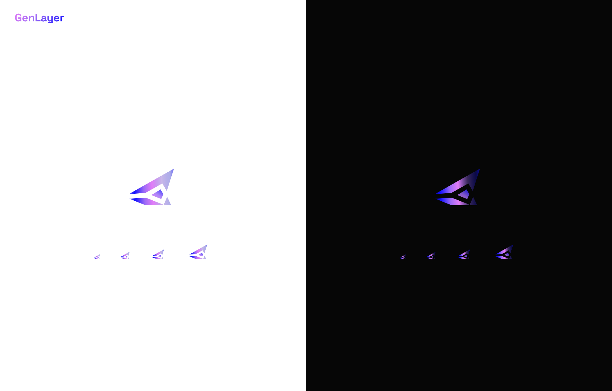

# GenLayer Spinner

An original animated loading spinner built on the **official GenLayer mark**. The
signature brand gradient (pink → purple → blue) streams upward through the two
blades in a seamless infinite loop, with the center gem always lit.



- **Format** — self-contained animated **SVG** (no JS, no dependencies, ~2 KB)
- **Loop** — seamless & infinite (1.6s linear; verified pixel-identical across the period)
- **Backgrounds** — works on light *and* dark; the idle track adapts via `prefers-color-scheme`
- **Small sizes** — legible from 16 px up
- **Accessible** — `role="img"`, `aria-label`, and honors `prefers-reduced-motion`
- **Identity** — uses the exact geometry of the official GenLayer logo (`favicon.svg`)

## Files

| Path | What it is |
|------|------------|
| `src/lib/genlayer-spinner.svg` | **The deliverable.** Drop-anywhere animated spinner. |
| `preview/index.html` | Presentation showcase — hero, size ramp, in-context, light + dark. |
| `preview/showcase.png` | Rendered preview of the showcase. |
| `tools/shoot.cjs` | Screenshot helper used to validate renders. |
| `lab/` | Exploration: earlier variants + a filmstrip QA harness. |

## Usage

As an image (simplest — the animation just runs):

```html

```

As a CSS background:

```css
.loading::before {
  content: "";
  display: inline-block;
  width: 24px; height: 24px;
  background: url(genlayer-spinner.svg) center / contain no-repeat;
}
```

Sizing is driven by the `width`/`height` you set — the SVG scales cleanly to any
size. Recommended range: 16–96 px.

### Accessibility
The SVG carries `role="img"` and `aria-label="Loading"`. Under
`prefers-reduced-motion: reduce` the beam holds mid-mark (no motion) while the
mark stays fully branded and the gem lit — so it still reads as a spinner without
animating.

## Brand tokens

From the GenLayer design system (`genlayer-design/colors_and_type.css`):

| Token | Value |
|-------|-------|
| `--gl-blue` | `#110FFF` |
| `--gl-purple` | `#9B6AF6` |
| `--gl-pink` | `#E37DF7` |
| Signature gradient | pink → purple → blue |

## Validate the render locally

Chromium needs a few shared libs that aren't system-installed here; they're
extracted under `.browserlibs/`. Point Chromium at them via `LD_LIBRARY_PATH`:

```bash
LD_LIBRARY_PATH="$PWD/.browserlibs/usr/lib/x86_64-linux-gnu:$LD_LIBRARY_PATH" \
  node tools/shoot.cjs preview/index.html out.png 1280 900 2 1200
```
